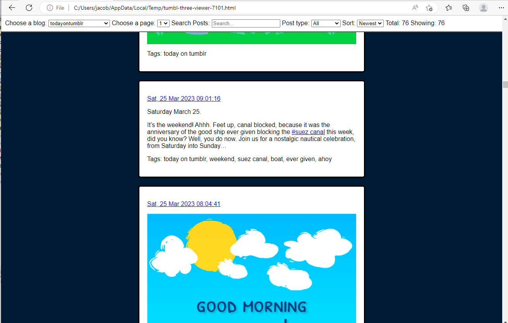

# TumblThree Backup Viewer

[](https://github.com/jacob-pro/tumbl-three-viewer/actions/workflows/rust.yml)


Minimal browser based viewer for [TumblThree](https://github.com/TumblThreeApp/TumblThree) backups.

## Metadata Support

To reliably reconstruct your blog posts it is recommended to have the following:

- Ensure your metadata was created by TumblrThree version 
  [2.10.0+](https://github.com/TumblThreeApp/TumblThree/issues/414) such that the `downloaded_media_files` field is
  present for all posts.
- Ensure you have "Metadata format" set to `json`.

## Install

```
cargo install --git https://github.com/jacob-pro/tumbl-three-viewer
```

## Usage

You should already have a downloaded blogs folder similar to:

```
Blogs/
├─ todayontumblr/
│  ├─ images.txt
│  ├─ videos.txt
│  ├─ texts.txt
│  ├─ efb4a9d659f14b4c8528ab9290498b42.jpg
│  ├─ f35943c3e844412d9d7d9b7b2e474d10.jpg
```

Launch the application either within the `Blogs` directory or using the argument:

```bash
tumbl-three-viewer --path "./Blogs"
```

## Screenshots

